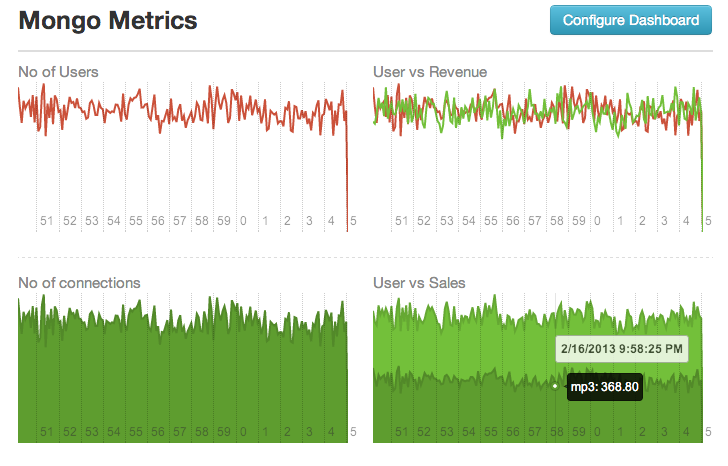
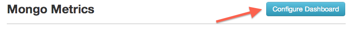

mongo-metrics
=============

When its comes to metrics, aggregations plays a huge role. If that fails, then there is no use of collecting metrics. Here is the how `mongo-metrics` thinks about it.

* There are sources who generate metrics
* metrics will be collected with the awareness of the source
* When it comes aggregations, metrics will be aggregated in 2 steps
* It will first aggregate values in each source, then result will be aggregated 
* function which used to aggregate metrics can be specified in runtime
* result will be grouped into time resolutions

## Design Decisions

* Cloud Ready
* Portable and Flexible Design
* Simple to use

## Dependencies

* Mongodb (2.1+)
* NodeJs

## Tracking Metrics

>Currently tracking is only supported for `nodejs` apps. For other apps, you have to wait for UDP and HTTP APIs (patches are welcome)

~~~js
	var MongoMetrics = require('mongo-metrics');

	var MONGODB_URL = "mongodb://localhost/test";
	var metrics = new MongoMetrics(MONGODB_URL);

	metrics.track('no-of-users', 344, 'my-source', function(err) {

	});
~~~

## Aggregate Metrics

>This API is for developer who need to play with metrics. Use dashboard(see below) which build on top of this API

#### API

 	@param {String} name - name of the metric
        @param {Constant} resolution - resolution type
            possible values: "DAY", "HOUR", "MINUTE", "FIVE_SECS"
        @param {String} valueAggregator - aggregation function to be used for aggregating metric of the each source
            possible values: "sum", "avg", "min", "max"
        @param {String} sourceAggregator - aggregation function to be used for the aggregating sources(value from metricsAggregation)
            possible values: "sum", "avg", "min", "max"
        @param {Object} query - mongodb query for filtering out metrics
            only supports date and source only
        @param {Function} callback - callback function
            callback(err, results)
    
    MongoMetrics.aggregate = function(name, resolution, valueAggregator, sourceAggregator, query, callback){}

#### Example

~~~js
	
var MongoMetrics = require('mongo-metrics');

var MONGODB_URL = "mongodb://localhost/test";
var metrics = new MongoMetrics(MONGODB_URL);

metrics.aggregate('no-of-users', 'hour', 'avg', 'sum', {date: { $gte: 1361030882576 }}, function(err, result) {

});
~~~

## Dashboard 

With Dashboard you can correlate and visualize your metrics. There are few ways you can access the dashboard.

#### 1. Standalone App

##### Install `mongo-metrics` binary via `npm`
    npm install mongo-metrics -g

##### Start Dashboard
    mongo-metrics -m <mongodb url>

#### 2. With NodeJS

~~~js
var dashboard = require('mongo-metrics/dashboard');

var MONGO_URL = "mongodb://localhost/test";
var PORT = 5005;
dashboard.listen(MONGO_URL, PORT);
~~~

#### 3. Embed with an existing `express` webapp

~~~js
var express     = require('express');
var dashboard   = require('mongo-metrics/dashboard');
var webapp      = express();

var MONGO_URL = "mongodb://localhost/test";
dashboard.listen(MONGO_URL, webapp);

webapp.listen(5005);
~~~

### Defining Graphs

Inside the Dashboard you can create as many graphs as you need. You can correlate metrics too. (use area chart type)

There is no UI for defining graphs. But we have simple and flexible syntax to define them. 
>We simply did no use JSON since, it is too heavy for taking user inputs 

#### Syntax

Here is how you define a graph. 

    <title for graph> | <graph-type> | <metric-name> | <value-aggregator>, <source-aggregator> | <resolution> | <time-length>

eg:- `CPU Usage | area | cpu | avg, sum | five_secs | 1000 * 60 * 15`

* Supported values for `graph-type` : `area`, `line`
* Supported values for `value-aggregator` : sum, avg, min, max
* Supported values for `source-aggregator` : sum, avg, min, max
* Supported values for `resolution` : five_secs, minute, hour, day
* You can use multiple lines to specify multiple graphs
* Empty lines add empty block to dashboard instead of the graph

### Permalink URLs

* Configuration you do will be saved in the URL. 
* So you can simply copy URL and share with others.
* You can http://bit.ly or http://goo.gl to shorten the URL

## Todo

See: [Issues](https://github.com/arunoda/mongo-metrics/issues?labels=todo&milestone=none&page=1&state=open)
